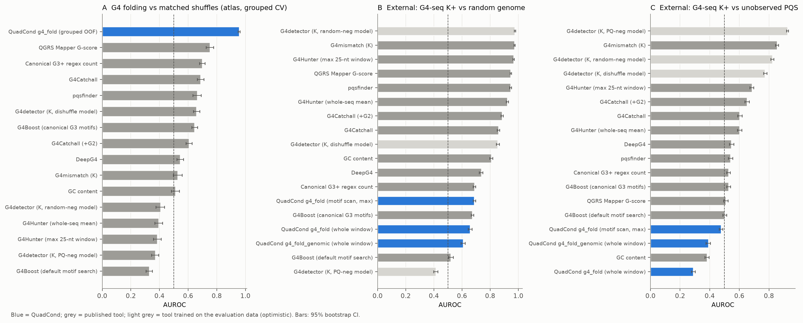
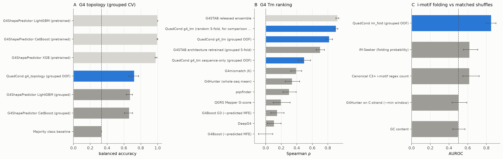
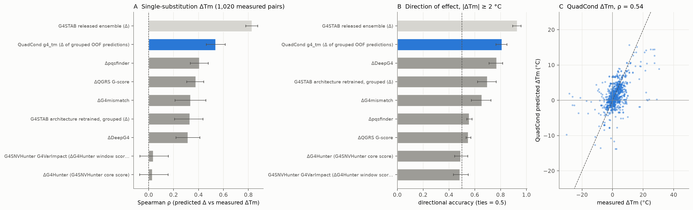
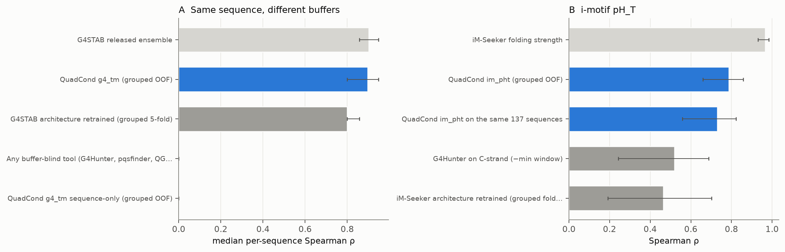

# QuadCond against published G4 / i-motif tools

*Run 17 September 2026 against commit `1c0793c` (package 0.5.0, model artifact 0.4.6,
sha256 `49364019…`, atlas_core fingerprint `4c5cca5a…`). Every number below is in
`results/benchmark_results.csv` with a 95 % bootstrap interval (500 resamples of
sequence clusters). Scripts that produced them are in `scripts/`.*

## Why this benchmark exists

`docs/EXTERNAL_BENCHMARK.md` compares QuadCond with two synthetic-data prototypes.
A reviewer will ask a different question: how does it compare with the tools
people actually use? This file answers that on every task where a published tool
makes a comparable prediction, and it says plainly where QuadCond loses.

## Tools run

| Tool | What it predicts | How it was run |
|---|---|---|
| G4Hunter (Bedrat 2016) | G-skew score | re-implemented (whole-sequence mean; max 25-nt window) |
| pqsfinder (Hon 2017) | PQS score | R package, GitHub source, `min_score=10`, both strands |
| QGRS Mapper (Kikin 2006) | G-score | re-implementation of the published scoring (max length 30); human telomere = 42 as on the web server |
| G4Catchall (Doluca 2019) | G4Hunter-like score of regex hits | original script; default and `--G2L` |
| G4Boost (Cagirici 2022) | fold probability + MFE | original v4 script, shipped JSON models; default motif search and `--minG 3 --maxG 4 --maxloop 7` |
| DeepG4 (Rocher 2021) | active-G4 probability | shipped Keras model (sequence-only), both strands |
| G4detector (Barshai 2021) | G4-seq probability | shipped K+ models (PQ, random, dishuffle negatives) |
| G4mismatch (Barshai 2023) | G4-seq mismatch score | shipped whole-genome K+ model, 15-nt windows with 100-nt flanks, max over windows and strands |
| G4ShapePredictor (Liew 2024) | topology | shipped LightGBM / CatBoost / XGBoost; **and** the same estimators retrained on QuadCond's folds |
| G4STAB (Liew 2025) | Tm from sequence + salts + pH | shipped 10-model ensemble; **and** the architecture retrained on QuadCond's folds (published Nadam settings, early stopping, one seed) |
| iM-Seeker (Yang 2024) | iM fold probability + folding strength (scaled pH_T) | original script with the figshare models under scikit-learn 1.3 (the version they were pickled with); **and** its regressor retrained on QuadCond's folds |
| G4SNVHunter (Zhang 2025) | ΔG4Hunter per variant | R package `G4VarImpact`, threshold 1, window 25 |

Not run: Quadron (needs a 2016 xgboost build), PENGUINN, G4RNA screener and
rG4-seeker (RNA), iDualG4 and iMotifPredictor (no public weights found), the
5DUVMA stability model (no code released), G4-iM Grinder (its scores are
G4Hunter/pqsfinder-type scores already covered above).

**Fairness rule.** QuadCond numbers are grouped out-of-fold predictions
(sequence clusters kept whole), re-derived here and matching the model card.
A tool whose released model was trained on the evaluation rows is marked
*in-sample* and shown in light grey: its number is an upper bound, not a
comparison. Where the tool's training recipe is available it was retrained on
exactly QuadCond's folds, which is the fair head-to-head.

## Results

### 1. G4 folding against matched shuffles (atlas, 1,874 G4s vs 3,340 shuffles)

QuadCond `g4_fold` AUROC **0.957** (0.949–0.963). Best published tool: QGRS
0.75, G4Catchall 0.69, pqsfinder 0.66. G4Hunter scores *below* 0.5 (0.39).

Read this carefully. Dinucleotide shuffles of short G-rich oligos often merge
G-tracts into G5–G7 runs, so G4Hunter scores them higher than the real G4s.
QuadCond wins because it learned the register of four tracts, which is exactly
what the shuffle destroys. **This is a constructed task and should not be the
headline.**

### 2. External: human G4-seq (K+) windows — QuadCond loses

124-nt G4-seq positives (3,000) vs random genomic windows (2,793) or
PQS-matching windows G4-seq did not observe (3,000).

| | vs random genome | vs unobserved PQS |
|---|---|---|
| G4mismatch | 0.972 | 0.854 |
| G4Hunter (max window) | 0.966 | 0.685 |
| pqsfinder | 0.945 | 0.540 |
| QGRS | 0.946 | 0.509 |
| **QuadCond `g4_fold`, motif scan** | **0.687** | **0.476** |
| **QuadCond `g4_fold`, whole window** | **0.657** | **0.289** |
| **QuadCond `g4_fold_genomic`** | **0.607** | **0.391** |

(G4detector 0.975 / 0.925 is in-sample: it was trained on these files.)

`g4_fold` does not transfer to genomic windows. The atlas negatives are shuffles,
not measured non-folders, and every training sequence is an oligo of ≤ 99 nt.
The applicability warnings fire correctly on these inputs, but the tool must not
be presented as a genome scanner until this is fixed (see "Before submission").

### 3. G4 topology (1,005 CD/NMR/X-ray structures, K+)

| | balanced accuracy |
|---|---|
| **QuadCond `g4_topology`** | **0.723** (0.651–0.774) |
| G4ShapePredictor LightGBM, retrained on the same folds | 0.672 |
| G4ShapePredictor CatBoost, retrained on the same folds | 0.662 |
| G4ShapePredictor released models (in-sample) | 0.98–1.00 |

On equal terms QuadCond is modestly ahead; intervals overlap.

### 4. G4 melting temperature (2,274 buffer-resolved G4STAB measurements)

| | R² | MAE °C | Spearman |
|---|---|---|---|
| **QuadCond `g4_tm`, grouped CV** | **0.672** | **5.56** | **0.819** |
| G4STAB architecture, retrained on the same grouped folds | 0.478 | 7.42 | 0.702 |
| QuadCond, random 5-fold (G4STAB's published protocol) | 0.826 | 3.76 | 0.905 |
| G4STAB paper, random 5-fold (reported) | 0.80 | 4.42 | — |
| G4STAB released ensemble (in-sample) | 0.835 | 3.29 | 0.924 |
| best buffer-blind score (G4mismatch) | — | — | 0.393 |

Under the same protocol QuadCond matches or beats G4STAB, and the grouped
number (0.67) is the honest one to quote: random splits put near-identical
sequences on both sides. The G4STAB retrain used one seed and early stopping,
so it may understate that architecture somewhat.

### 5. Buffer response of the same sequence (128 sequences, ≥ 4 buffers each)

Median per-sequence Spearman between measured and predicted Tm across buffers:
QuadCond **0.90**, G4STAB retrained 0.80, G4STAB released (in-sample) 0.90.
Every other tool here returns the same score whatever the buffer, so 0 by
construction. The sequence-only ablation also scores 0. This is the clearest
evidence for the condition-aware design.

### 6. Single-base substitutions with measured ΔTm (1,020 pairs, 216 parents, same buffer)

Built from the atlas: every pair of sequences that differ at one position and
were melted in the same buffer. Both members of a pair are always in the same
cluster, so QuadCond's Δ is fully held out.

| | Spearman | direction correct, \|ΔTm\| ≥ 2 °C (596 pairs) |
|---|---|---|
| **QuadCond `g4_tm` Δ** | **0.537** (0.46–0.61) | **0.81** |
| G4STAB architecture retrained (same folds) | 0.331 | 0.70 |
| Δpqsfinder | 0.406 | 0.56 |
| ΔQGRS | 0.378 | 0.55 |
| ΔG4mismatch | 0.336 | 0.65 |
| ΔDeepG4 | 0.315 | 0.77 |
| **G4SNVHunter** (`G4VarImpact`) | **0.036** (−0.07–0.16) | **0.48** |
| G4STAB released (in-sample) | 0.829 | 0.93 |

This is the strongest result for the variant use case: on measured stability
changes, G4SNVHunter — the only released variant-effect tool for G4s — is at
chance, and QuadCond is the best held-out predictor.

### 7. i-motifs

| | metric | value |
|---|---|---|
| **QuadCond `im_fold`** vs shuffles (160 + 144) | AUROC | **0.851** |
| iM-Seeker fold probability | AUROC | 0.620 |
| canonical C3+ regex | AUROC | 0.618 |
| **QuadCond `im_pht`** (160) | Spearman / R² | **0.786 / 0.585** |
| QuadCond `im_pht`, the 137 with an iM-Seeker motif call | Spearman / R² | 0.730 / 0.484 |
| iM-Seeker regressor retrained on the same folds (137) | Spearman / R² | 0.465 / 0.253 |
| iM-Seeker released (trained on these pH_T values) | Spearman | 0.966 (in-sample) |

iM-Seeker's classifier was trained on HEK293T iMab CUT&Tag, so its fold task
differs from this one. Its regressor was trained on these very pH_T values.

### 8. AlphaGenome join: a positive control

The chr22 window remains a negative control (0 / 183 structural deltas). On six
published promoter G4s the same `g4_tm` scan (K 140, Na 10, Mg 1 mM, pH 7.4,
37 °C) does return structural deltas:

| control | substitutions | with Δ | motif lost | \|Δ\| ≥ 5 °C | most destabilising |
|---|---|---|---|---|---|
| MYC Pu27 | 81 | 81 | 0 | 10 | −7.2 °C |
| VEGFA Pu22 | 69 | 45 | 24 | 7 | −9.4 °C |
| BCL2 Pu39 | 117 | 105 | 12 | 9 | −6.8 °C |
| hTERT hT21 | 66 | 36 | 30 | 4 | −3.3 °C |
| KIT c-kit1 | 66 | 30 | 36 | 3 | −1.8 °C |
| KIT c-kit2 | 63 | 30 | 33 | 1 | −3.0 °C |

`alphagenome_bridge/positive_controls.py` finds these motifs in hg38 through the
UCSC API, derives the exact windows and runs the full join. It needs your
AlphaGenome key. It was not run in the sandbox, because UCSC is blocked there.
Substitutions that remove a motif currently carry no Δ, only a
`motif_lost` state. They are the most disruptive class, so the 2×2 should count
them as structural-high explicitly.

## What this means

**New and defensible:** (i) buffer-conditioned G4 Tm that beats the only other
condition-aware tool when both are retrained on the same folds; (ii) the
same-sequence buffer-response benchmark, which no buffer-blind tool can
attempt; (iii) the measured single-substitution ΔTm benchmark, on which the
existing variant tool is at chance; (iv) calibrated i-motif fold and pH_T that
beat iM-Seeker on equal terms; (v) the AlphaGenome join as a prioritisation
layer. As far as a literature search found, no published tool combines these.

**Not defensible yet:** genome-scale G4 detection (section 2); any claim about
i-motif buffer response for new sequences (only two 5DUVMA constructs); the
in-cell meaning of the genomic-proxy heads.

## Before submission

1. **Fix or demote `g4_fold` for genomic use.** Either retrain with measured
   non-folders plus genomic negatives (G4-seq unobserved PQS are a ready source),
   or in the web server route genomic windows to a validated scanner
   (G4Hunter/pqsfinder) and use QuadCond only for stability, topology and Δ.
   Report section 2 either way.
2. **Lead the paper with sections 4–6**, and include the ΔTm pair set as a
   released benchmark; it is itself a contribution.
3. **Give `motif_lost` substitutions a structural rank** in the 2×2.
4. **Publish the assets.** Every `url` in `assets_manifest.json` is `null`, so
   a colleague who clones the public repo cannot run it. Attach the model and atlas
   to a tagged GitHub release, then archive it on Zenodo.
5. **Run `positive_controls.py`** and add one positive-control figure to the paper.
6. **Genome-wide scale (all chromosomes).** Needed for the paper, but not as
   "all 9 billion variants". Take every SNV inside G4/iM motifs on chr1–22 and X,
   plus matched out-of-motif controls, and read the AVI scores from the
   88.5 GB AVI Tabix bundle (commercial-use licence, read by seek), not the live API.
   Test whether structure-changing SNVs carry larger AlphaGenome effects than
   matched controls. That is the biological result the paper needs.
7. Commit the 11 modified web files (currently only in the working tree).

## Reproduce

Scripts assume the tool repositories cloned beside them (paths at the top of each
script); `scripts/qc_oof.py` re-derives QuadCond's grouped predictions, and
`scripts/analyze.py` rebuilds `results/benchmark_results.csv`.
